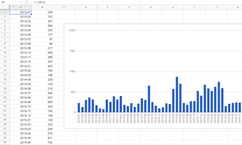

# fb-messenger-parser
JS parser for Messenger archive data

You should obtain archive from Facebook web: https://www.facebook.com/dyi/
I have chosen this:

I have some 54 k "sent" messages since 2012. `find . -type d -name "photos" -or -name "files" | xargs rm -r` helped reduce the folder to 630 mb.

## Usage

- put the downloaded `messages` folder into this folder
- run `node messages.js`
- expect file `data.csv` as an output

Plot in some Spreadsheets:

